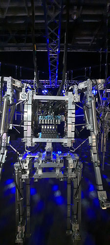
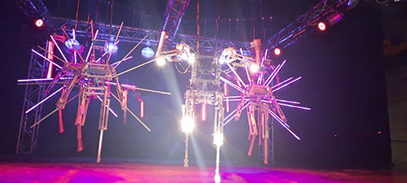
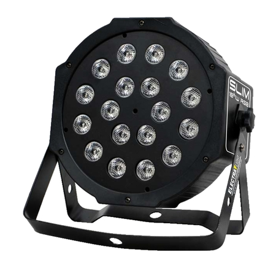

# Projet arsenal keven malric

<h1><em>Voici l'affiche de l'exposition biannuelle intitulée mutation, 6e exposition d'arsenal!</em></h1>

 
Travail dans le cadre du cours de documentation sur le Bian no.6 d'Arsenal.

<h2>L'addresse de l'exposistion est la suivante: 2020, Rue William,Montréal,Québec</h2>

 La photo est un selfie.

<h2>Type d'exposition</h2>

Le type d'exposition est temporaire et intérieur.

<strong>Cette exposition est, comme sont nom l'indique, biannuelle.</strong>

<h2>Date de viste de Arsenal :</h2>

<em> 2 Février 2023, de 14h à 15h35.<em>
  

<h2>Titre de l'oeuvre</h2>
  
<h3><em>Copacabana Machine Sex</em></h3>
  
  

  
  
<h2>Nom de l'artiste</h2>
  
<strong><em>Bill Vorn</em></strong>
  
<h2>Année de réalisation</h2>
  
<em>2018</em>  

<h2>description de l'oeuvre</h2>
  
Copacabana Machine Sex est un spectacle robotique et musicale de 30 minutes impliquant des machines suppportées par des câbles comme acteurs. L'idée conceptuelle de Bill Vorn est de concevoir une situation  théorique en réponse à la question suivante : "que se passerait-il si des machines pouvait performer sur  scène ?". Le spectacle de Copacabana peut être décrit comme un mini-spectacle de Music Hall, d'où son titre,vue les similitudes constaté en trème de noms. Il est question d'une succession de numéros musicaux où des machines se produisent tel acteurs, musiciens et danseurs. Généralement,les œuvres de vorn on tous en communs un syle hybride entre le kitsch classique de Broadway et une ambiance industrielle sombre. Comme la plupart de ses œuvres, il s'agit d'une exploration des formes et des mouvements robotiques par interime de la musique, du son et de la lumière. Avec cette pièce, le but de l'artiste est d'immiter les comportements humains de manière inhabituelle à travers des actions simplistes de machines présentées dans un contexte de scène.
  
   
  
  
  

  
  
  

  
  
  

  
  
  

  
  
  

  
  
  

  
  
  
  <h2>Type d'instalation</h2>
  
  https://youtu.be/9_nL3roINQ0
   contemplative et immersive
  
  
  <h2>Mise en espace</h2>
  
  
  Dans la pièce dédiée à l'oeuvre multimédia, des pourtres de métal reliés entre eux en forme de cubes soutiennent les robots avec des câbles attachée à la structure. La disposition des robots est la suivante :
  
  
  * Pattes de robots uniquement: arrière de la scène
  
  * robots secondaires:  millieux de la scène
  
  * robots principal et 6 crânes: devant de la scène
  
  
     
  
  
  
  
  
  
  <h2>composantes et techniques</h2>
  
 
  
  * <h3>écalirage LED</h3>
  
  
  
  
  
  * <h3>Boules diso</h3>
  
  
  

  
  
  * <h3>Compresseur à air,  Pistons, Moteurs, Ordinateur</h3>
  
  
  
  
  
  
  
  
   
  
  
  * <h3>Câbles de support et squelettes de robots</h3>
  
  
  
  
  
  
  
  
  <h2>Éléments nécessaires à la mise en exposition</h2>
  
  * Support en metal
  
  
  
  * Fils de branchements
  
  * Projecteur led et stroboscope
  
  
  
  
  
  * La pièce pour l'exposition
  
  
  <h2>Expérience vécu</h2>
  
  Le visiteur est assis devant la scène et il regarde les robots dancer au rythme de la musique. 
  Il n'y a aucune interaction physique entre le visiteur et l'oeuvre.
  
  
  
  
  <h2>Ce qui m'as a plu, m'as a donné des idées</h2>
  
  Comme tel, j'ai bien aimé le timing des lumières et du son. La sycronisation était immesive,  elle as donnée de la vie au spectacle robotique. 
  Également, les détails affichés sur les écrans placés sur la tête des robots étaient divertissants.
  
  
  <h2>Aspect que je ne souhaiterais pas retenir pour mes propres créations ou que je fairais autrement</h2>
  
  L'aspect répétitif de la corégraphie était d'un ennuis épouvantable. En plus, je diversifirais la bande audio pour éviter le lâssage dû à la répétition.
  
  
  <h2>sources</h2>
  
  https://billvorn.concordia.ca/menuall.html
  
  
  https://www.elektramontreal.ca/bian2022-bill-vorn?lang=fr
  
  
  https://www.prozic.com/www2/info_promo_PARLED54W-SL_projecteur-led-deco.html
