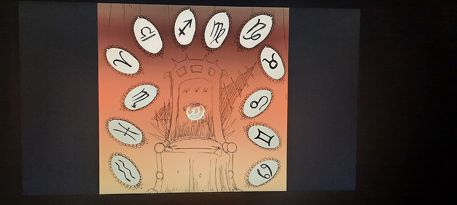
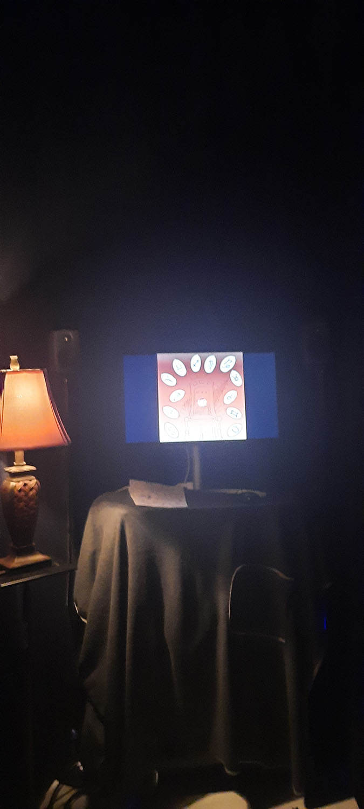
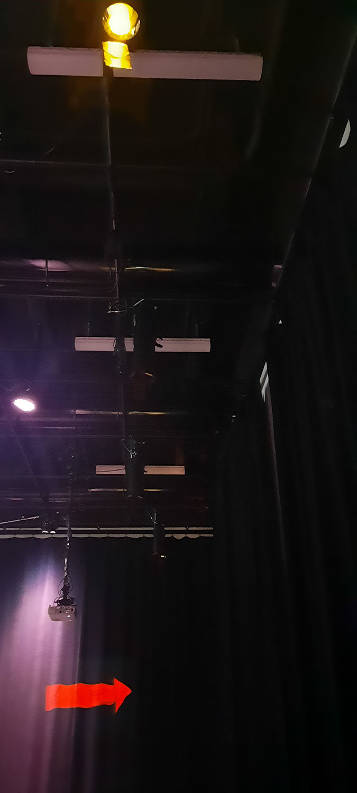
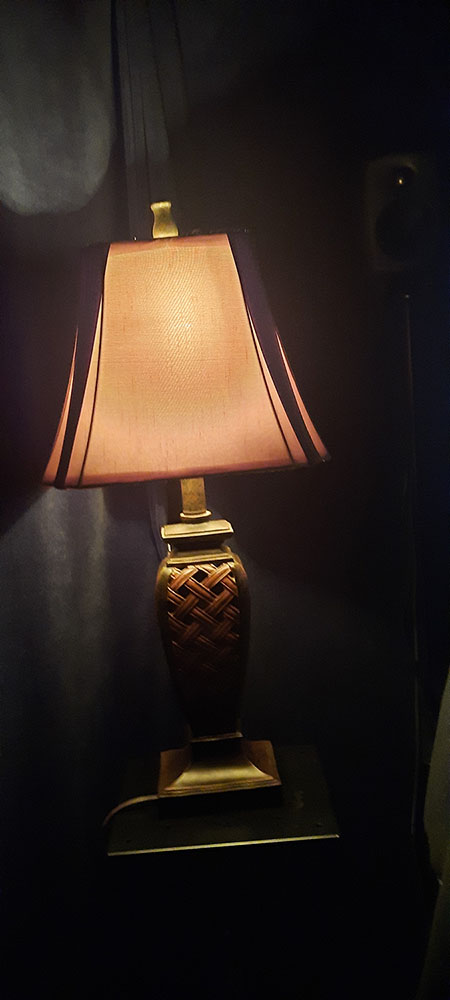
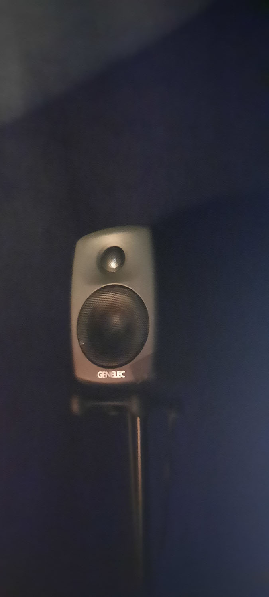
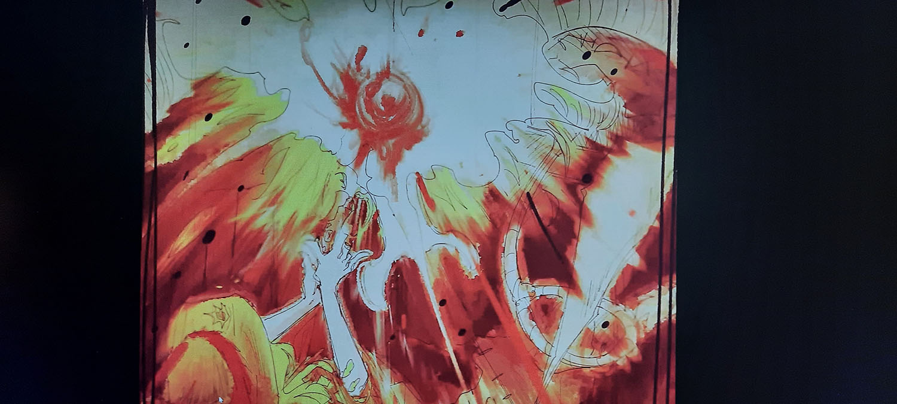
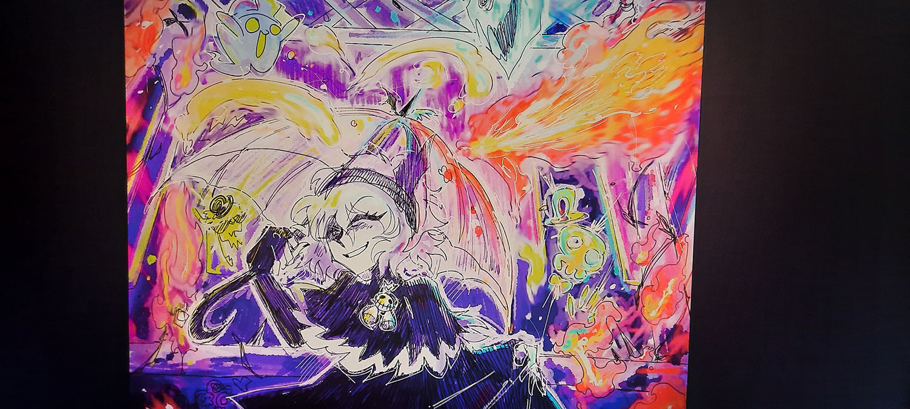

<h1>Mon projet préféré</h1>

# Zodie-Gal 

<h2>Par Abdanor Yara</h2> 

 
<h2>Année de réalisation</h2> 
2023

<h2>Description de l'œuvre</h2> 

Un jeu d'aventure qui se base sur la période de puberté d'une jeune fille et ses craintes d'adolescentes.
 

Zodie-Gal est un jeu web d'aventure et de chercher et trouve où il faut aider une jeune fille à trouver des moyens de tuer les monstres correspondant au signe du Zodiaque en cliquant sur le bon objet dans l'image. Il y a 12 niveaux au total, un pour chaque signe du zodiaque. Chaque niveau contient 2 images: une image pour trouver le bon objet à utiliser contre le Zodiac et une image qui montre la victoire au joueur face aux monstres du Zodiac.

<h2>Note<h2> 
9.7/10
 
<h2>Date de visite</h2> 
<h3><em>23/03/2023<em><h3>  
<h2>Addresse d'exposition</h2>  

475 Boulevard de l'avenir, Laval, QC H7N-5H9 
 
<h2>Type d'installation</h2> 

Intrérieur,temporaire,interactif
 
<h2>Mise en espace</h2> 
  

 

L'œuvre est placée dans un coin du grand studio. Les visiteurs sont guidés par de petites flèches jaunes et rouges animées vers l'ordinateur afin d'interagir avec l'œuvre. Celui-ci est placé sur un chariot et est éclairé par une lampe, lui donnant une ère sinistre.
 
<h2>composantes et techniques</h2> 
Un portable et un accès à internet 
 
<h2>Éléments nécessaires à la mise en exposition</h2> 
De façon hypothétique, nous aurions besoin d'un portable, de câbles de branchements, d'une clef USB pour le transport des données du jeu et j'imagine que le décor sera à la digression de ceux responsables de l'exposition. 
 
  
 
 
 
<h2>Expérience vécue</h2> 
Les visiteurs approchent le portable et ils se mettent à jouer au jeu. Ils sont récompensés par un son de cloche s’ils trouvent l'objet caché.
 
<h2>Ce qui m'a a plu & m'as a donné des idées</h2> 
Les effets visuels sont incroyables et l'audio incluant, la musique, reflète parfaitement l'ambiance d'aventure sinistre décrite dans la description de l'auteur.
 
  
  
 
<h2>Aspect que je souhaiterais retenir pour mes propres créations</h2> 
Je prendrai note du timing des effets sonores, car ils étaient placés stratégiquement pour capter l'attention du visiteur et donnant de fait même envie de continuer le jeu jusqu'à la fin.
 
<h2>Aspect que je ne souhaiterais pas retenir pour mes propres créations ou que je ferais autrement</h2> 
je simplifierais les illustrations utiliser, car il était très difficile de comprendre et d'apprécier les diverses  de l'artiste.
 
  

 

<h2>Médiagraphie</h2>

