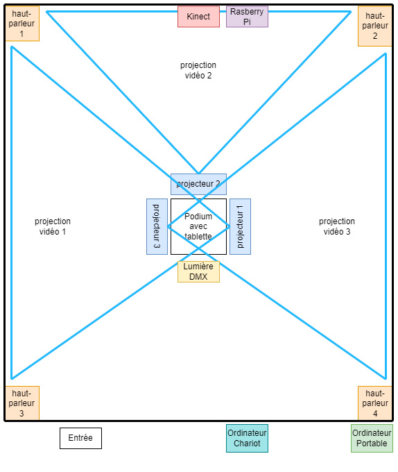
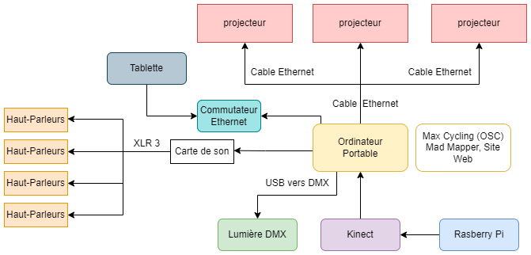
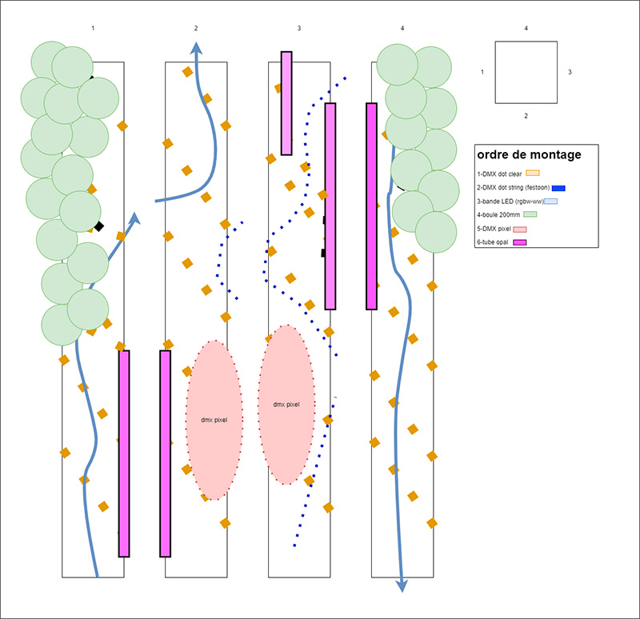
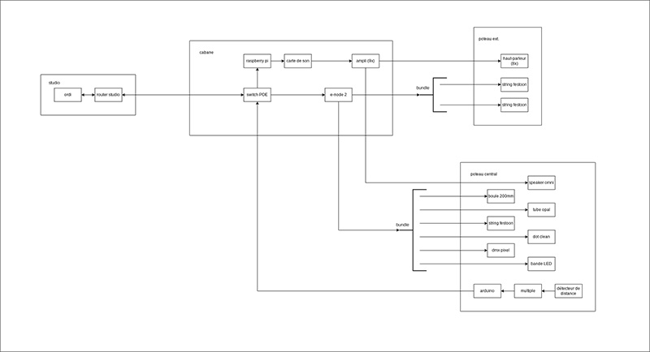

# echomarine 

<h2>Florence Lapierre, Natacha Abdallah, Tracy Gua et Maria Laura Coronel </h2>

https://tim-montmorency.com/2023/projets/Echomarine/docs/web/index.html 

<h2>Schéma de plantations</h2>  

 
 

   <h2>Schéma de branchements</h2>   
 

# Edria 

<h2>Elwin Durand, Loic Delorme, Dominic Roberts, Gabriel Leblanc, Meryem Berbiche et  Jean-Christophe</h2>

https://tim-montmorency.com/2023/projets/EDRIA/docs/web/index.html 

<h2>Schéma du poteau central</h2>

<h2>Schéma de branchements</h2>

# Luma sol 

<h2>Éloïse Gagné Éloïse Gagné, Skayla Stimphil Skayla Stimphil, Michaël simard Michaël Simard et Pénélope Morrisson</h2>

https://tim-montmorency.com/2023/projets/LumaSol/docs/web/index.html 
# Boucler La Boucle 

<h2>Créateurs/créatrices</h2>

https://tim-montmorency.com/2023/projets/Boucler-la-boucle/docs/web/index.html 
# Zodie-Gal 

<h2>Créateurs/créatrices</h2>

https://tim-montmorency.com/2023/projets/Zodie-Gal/docs/web/index.html

# Sources:
# 1: 
https://tim-montmorency.com/2023/projets/Echomarine/docs/web/index.html
# 2: 
https://tim-montmorency.com/2023/projets/EDRIA/docs/web/index.html
# 3: 
https://tim-montmorency.com/2023/projets/LumaSol/docs/web/index.html
# 4: 
https://tim-montmorency.com/2023/projets/Boucler-la-boucle/docs/web/index.html
# 5: 
https://tim-montmorency.com/2023/projets/Zodie-Gal/docs/web/index.html
# 6: 
https://tim-montmorency.com/2023/projets/Echomarine/docs/web/preproduction.html
# 7: 
https://tim-montmorency.com/2023/projets/EDRIA/docs/web/preproduction.html#schémas-ou-plans-techniques
