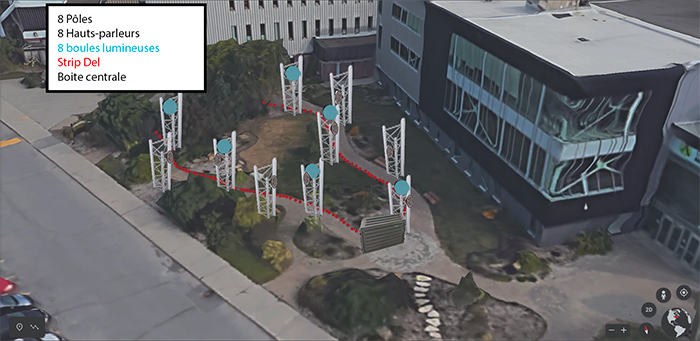

# echomarine 

<h2>Florence Lapierre, Natacha Abdallah, Tracy Gua et Maria Laura Coronel </h2>

https://tim-montmorency.com/2023/projets/Echomarine/docs/web/index.html 

<h2>Schéma de plantations</h2>  

 
 

   <h2>Schéma de branchements</h2>   
 
 
  
 
  <h2>3 cours que je crois essentiel à la réalisation du projet </h2>
    
  
cours de desing graphique, cours de web et cours audio

  
  
 
 <h2>technique ou composante que je ne connaissais pas</h2>
 

<h2>9.5/10</h2>

 

# Edria 

<h2>Elwin Durand, Loic Delorme, Dominic Roberts, Gabriel Leblanc, Meryem Berbiche et  Jean-Christophe</h2>

https://tim-montmorency.com/2023/projets/EDRIA/docs/web/index.html 

<h2>Schéma du poteau central</h2>

<h2>Schéma de branchements</h2>

   

  <h2>3 cours que je crois essentiel à la réalisation du projet </h2>
    
  
cours d'instalation multimédia, cours d'expérience multimédia et cours de conception audio

  
  <h2>technique ou composante que je ne connaissais pas</h2>
   
  
  <h2>8.5/10</h2>
  
   

# Luma sol 

<h2>Éloïse Gagné Éloïse Gagné, Skayla Stimphil Skayla Stimphil, Michaël simard Michaël Simard et Pénélope Morrisson</h2>   

    
 
     

https://tim-montmorency.com/2023/projets/LumaSol/docs/web/index.html
   

  <h2>3 cours que je crois essentiel à la réalisation du projet </h2>
    
  
cours d'instalation multimédia, cours d'expérience multimédia et cours de conception d'une expérience multimédia
 
  
  <h2>technique ou composante que je ne connaissais pas</h2>  
  
  <h2>7/10</h2>
  
   

# Nexum 

<h2>Shémat de branchements</h2>

<h2>Shémat de plantation</h2>

<h2>Sébastien Reilly, Sabrina Laforest, Alexandre Daniel et Maxime Des Lauriers</h2>

(https://tim-montmorency.com/2023/projets/Nexum/docs/web/index.html)
   

  <h2>3 cours que je crois essentiel à la réalisation du projet </h2>
    
  
cours d'instalation multimédia, cours d'expérience multimédia et cours de conception audio
 
  
  <h2>technique ou composante que je ne connaissais pas</h2> 
  
  <h2>6.5/10</h2>
  
    
  
# Zodie-Gal 

<h2>Abdanor Yara</h2>

https://tim-montmorency.com/2023/projets/Zodie-Gal/docs/web/index.html
   

  <h2>3 cours que je crois essentiel à la réalisation du projet </h2>
    
  
cours de web, cours d'introduction javascript et cours de conception d'une expérience multimédia
 
  
  <h2>technique ou composante que je ne connaissais pas</h2> 
  
  <h2>5/10</h2>
   

# Sources:
# 1: 
https://tim-montmorency.com/2023/projets/Echomarine/docs/web/index.html
# 2: 
https://tim-montmorency.com/2023/projets/EDRIA/docs/web/index.html
# 3: 
https://tim-montmorency.com/2023/projets/LumaSol/docs/web/index.html
# 4: 
https://tim-montmorency.com/2023/projets/Boucler-la-boucle/docs/web/index.html
# 5: 
https://tim-montmorency.com/2023/projets/Zodie-Gal/docs/web/index.html
# 6: 
https://tim-montmorency.com/2023/projets/Echomarine/docs/web/preproduction.html
# 7: 
https://tim-montmorency.com/2023/projets/EDRIA/docs/web/preproduction.html#schémas-ou-plans-techniques
