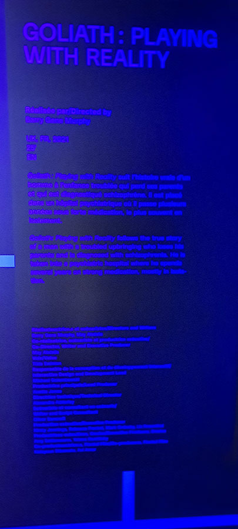
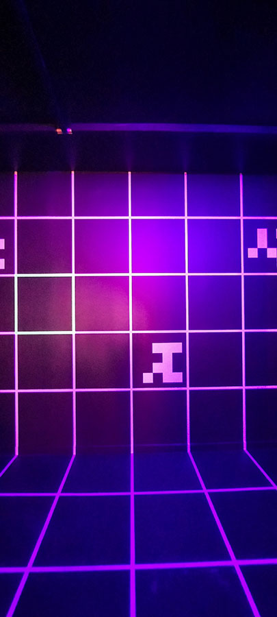
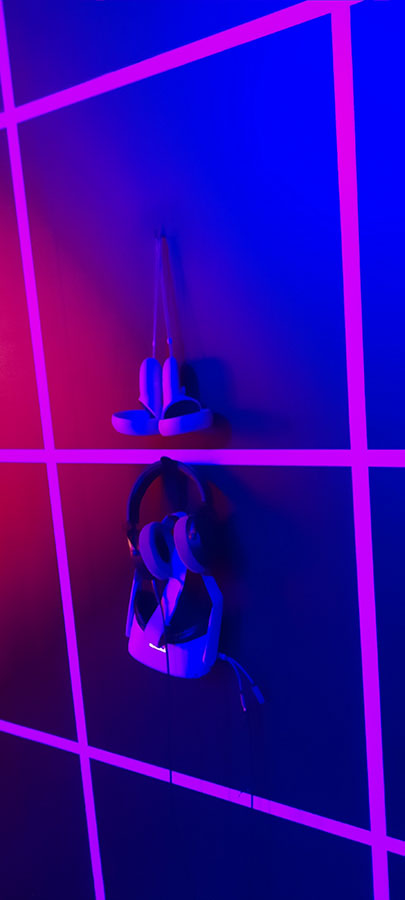
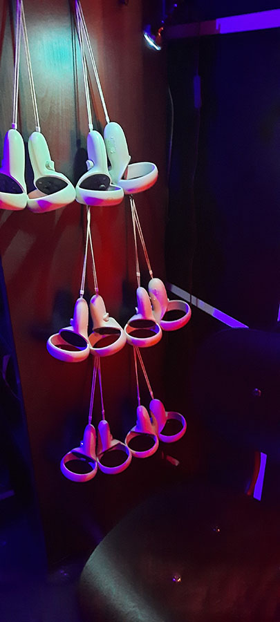
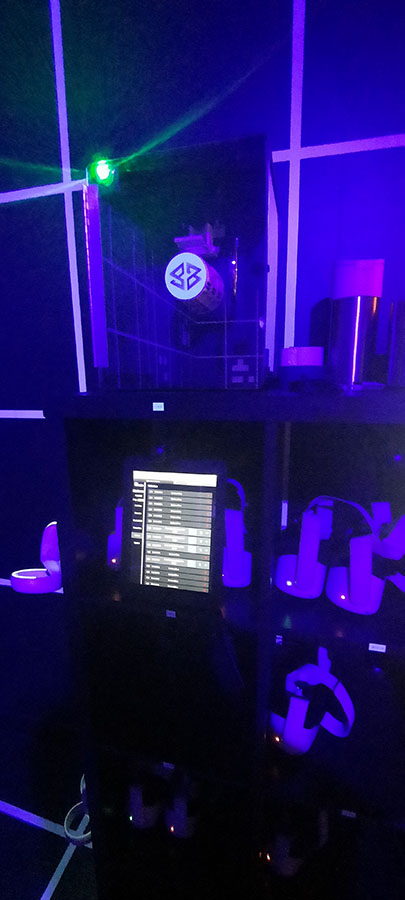
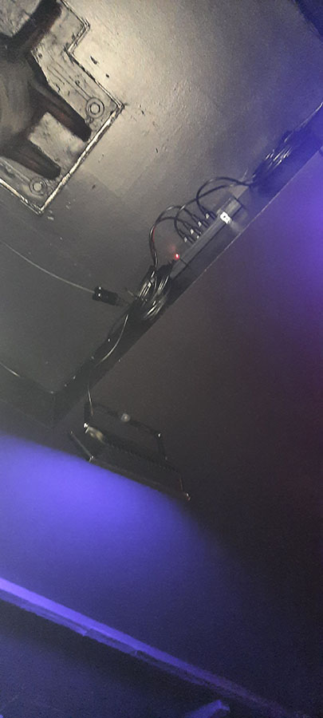

<h2>Nom de l'exposition</h2>

<strong> VR Horizon </strong>

<h2>Addresse de l'exposition</h2>

Centre PHI

315 Rue Saint-Paul Ouest,Montréal,QC H2Y-2M3

<h2>Date lors de la visite de l'exposition</h2>

<em> 5 mars 2023</em>

<h2>Nom de l'œuvre</h2>

Goliath

<h2>Type d'explosion</h2>

Le type d'exposition est temporaire et intérieur.

<h2>Description de l'œuvre</h2>

L'œuvre est une expérience de réalité virtuelle explorant la vie d'un schizophrène surnommé Goliath dû au fait qu'il joue aux jeux vidéo, car sa le centre sur sa conception de la réalité. l'expérience nous fait réaliser que chaque personne peut facilement perdre sa conception du réel comme démontré à la fin ou Goliath nous demande si nous avions compris que nous étions toujours dans le jeu en réalité virtuelle.

<h2>Type d'installation</h2>

Le type d'installation est immersive et interactive, car Goliath nous fait vivre l'expérience d'être schizophrène.

<h2>Mise en espace</h2>

La pièce est sombre et stylé pour ressembler à un l'intérieur d'un vieux jeu vidéo. Il y a des bancs pour s'asseoir. Les casques VR et les commandes sont accrochés sur les murs. Les haut-parleurs sont dans les coins de la pièce.

 

<h2>composantes et techniques</h2>

Ça prend des casques VR et les commandes correspondantes pour vivre l'expérience.

<h2>Éléments nécessaires à la mise en exposition</h2>

Les câbles sont cachés au plafond et sont relier aux lumières pour l'ambiance. un ordinateur central est présent pour permettre aux opérateurs de débuter l'expérience et de réparé les bogues et autres bris s’il y a lieu.

 

<h2>Expérience vécue</h2>

L'interaction entre le visiteur et l'œuvre est virtuelle. Les visiteurs portent un casque et ils ont, entre leurs mains, des manettes liées au casque de réalité virtuelle.

<h2>Ce qui m'a plu et m'as donné des idées</h2>

L'expérience m'a globalement plu. Toutefois, ce que j'ai apprécié le plus, c'est le côté plus psychologique de l'œuvre, ce qui m'as fait réfléchir au concept de la réalité. Les mini jeux comme distraction incarnaient les points et arguments présentés par l'audio de l'œuvre.

<h2>Ce que je ferais autrement</h2>

Je ferais en sorte que les visiteurs aient l'option de se déplacer à pied pour une meilleure immersion.

